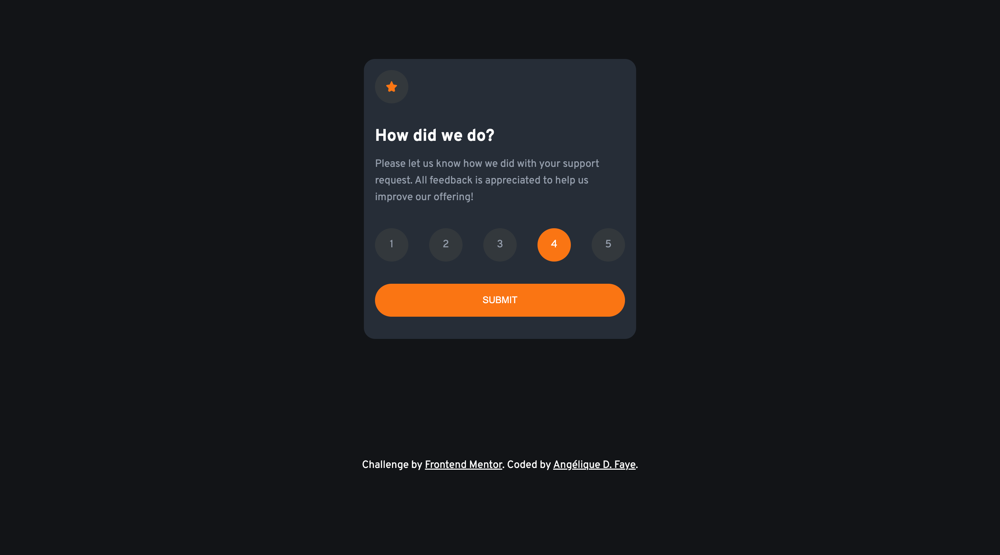

# Interactive rating component

  
  
  
  

## Overview

_A component to gather quick feedback from your customers!_

## Links

<a href="https://github.com/AngeliqueDF/interactive-rating-component.git">GitHub repo</a> • <a href="https://interactive-rating-component-black.vercel.app/">Live demo </a>

 

## How to run the project

1. `git clone https://github.com/AngeliqueDF/interactive-rating-component.git MY_FOLDER_NAME`
2. `cd MY_FOLDER_NAME`
3. `npm install`
4. `npm start`
5. visit `http://localhost:3000`

## Features

- Responsive
- Framework/library free
- Accessible

## Author

- [@AngeliqueDF on GitHub.](https://github.com/AngeliqueDF)
- [Visit my website.](https://adf.dev)
- [View my Frontend Mentor profile.](https://www.frontendmentor.io/profile/AngeliqueDF)
